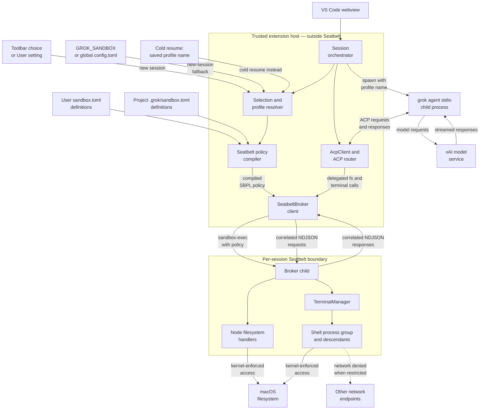

# macOS Sandbox Architecture

The extension uses Apple Seatbelt to contain the filesystem and terminal work
that Grok delegates to its ACP client. This page explains the trust boundary,
how a profile becomes a running policy, what the policy does and does not
protect, and how failures are handled.

For the extension-wide component and message-flow overview, return to the
[general architecture document](architecture.md).

This subsystem is macOS-only. On Linux and Windows the sandbox selector is not
shown and ACP operations continue to use the ordinary extension-host backend.

## Why the broker exists

`grok agent stdio` is not the process that performs most file edits and shell
commands. It asks its ACP client—the VS Code extension—to perform these
operations through mandatory server-to-client methods such as
`fs/write_text_file` and `terminal/create`.

Putting only the Grok CLI inside a sandbox would therefore miss the operations
that matter. Instead, the extension keeps the CLI and its model connection
outside Seatbelt and, for every live conversation whose resolved profile is
not `off`, places a dedicated execution broker inside Seatbelt. Every delegated
filesystem operation, terminal, and command descendant for that conversation
goes through its broker. An `off` session uses the ordinary host backend.

## Process topology and trust boundary



The extension host is part of the trusted computing base. It reads the selected
profile, compiles the policy, launches the broker without a shell, and routes
ACP requests. The Grok CLI also remains outside the broker policy so denying
network access to command children does not disconnect the model.

The broker boundary covers operations delegated through ACP. It does not claim
to sandbox the VS Code extension host, the webview, or arbitrary direct I/O a
future Grok CLI might perform without ACP.

## Profile selection

New sessions resolve one profile name in this order:

1. A project-only choice stored in VS Code extension `workspaceState`.
2. The User-scoped `grok.sandboxProfile` setting.
3. The extension's global-state fallback, used by VS Code-derived hosts that
   temporarily reject the registered setting during an upgrade.
4. `GROK_SANDBOX` from the extension host's environment.
5. `[sandbox] profile` in global `$GROK_HOME/config.toml`.
6. Off—no broker and no Seatbelt policy.

An explicit `off`, `none`, or `false` at a higher-precedence layer stops the
search. Repository VS Code settings and project `.grok/config.toml` never select
a profile. A project `.env` may supply ordinary CLI credentials, but it cannot
override `HOME`, `USERPROFILE`, `GROK_HOME`, `GROK_SANDBOX`, `TMPDIR`, `TMP`, or
`TEMP`.

Cold resumes use a different rule: `summary.json.sandbox_profile` supplies the
profile name. An unreadable summary or a non-string field aborts the resume;
legacy summaries with no field resume with the sandbox off.

Only the **name** is persisted. The extension recompiles that name from the
current profile definitions on every cold resume. Editing or removing a custom
definition can therefore change or prevent a later resume. A live session is
unaffected because Seatbelt policy is fixed when its broker process starts.

## Profile definitions and inheritance

Custom definitions are read from:

1. `$GROK_HOME/sandbox.toml`—normally `~/.grok/sandbox.toml`.
2. `<project>/.grok/sandbox.toml`.

The project file replaces a same-name user definition rather than merging with
it. Built-in names are reserved and cannot be redefined. Selecting a custom
profile therefore means trusting the open project's same-name definition, if
one exists.

Supported fields are:

| Field | Meaning |
|---|---|
| `extends` | Built-in or custom parent. Omitted means `workspace`. |
| `restrict_network` | Override the inherited network verdict. |
| `read_only` | Add readable paths. |
| `read_write` | Add readable and writable paths. |
| `deny` | Add exact paths or supported glob patterns denied for both read and write. |

Inheritance is recursive. Path arrays and deny entries are additive and
deduplicated; `restrict_network` uses the nearest explicit value. Duplicate
fields, unknown fields, malformed arrays, missing parents, inheritance cycles,
and unsupported glob syntax are startup errors.

Example: an offline workspace with explicit secret-file read protection:

```toml
[profiles.offline-workspace]
extends = "read-only"
read_write = ["."]
deny = ["**/.env", "**/*.pem"]
```

A custom profile may deliberately `extends = "off"`. That creates a deny-list
style policy with no general read/write containment; only the hard guards,
explicit `deny` entries, and any requested network restriction remain. This is
powerful and should not be described or treated as equivalent to `workspace`,
`read-only`, or `strict`.

## Built-in profiles

| Profile | Reads | Writes | Command networking |
|---|---|---|---|
| `off` | No Seatbelt containment; ordinary host backend | No Seatbelt containment; Plan-mode gates still apply | Allowed |
| `workspace` | Any path | Project except protected control-plane paths, trusted temp roots, session `plan.md` | Allowed |
| `read-only` | Any path | Session `plan.md` only; no ordinary project writes | Denied |
| `strict` | Project, `$GROK_HOME`, trusted temp, standard system and runtime roots | Project except protected control-plane paths, trusted temp roots, session `plan.md` | Denied |

`workspace` and `read-only` are integrity-oriented profiles, not
confidentiality boundaries: both permit reads from any path. `strict` narrows
reads, but intentionally includes `$GROK_HOME` plus the runtime and system paths
required to launch the broker and common command-line tools.

Custom profiles inherit one of these base behaviors and then add their own path
and network rules. All non-off rows remain subject to the hard write guards
described below.

## Session startup

For a non-off profile, startup is ordered deliberately:

1. Build the CLI environment while filtering protected project `.env` keys.
2. Select the profile name or recover it from a cold-session summary.
3. Parse the current user and project definition files.
4. Resolve inheritance, normalize macOS path aliases, compile deny globs, and
   emit one Seatbelt policy.
5. Launch the broker child with `/usr/bin/sandbox-exec -p <policy>` and wait for
   its `ready` message.
6. Create `AcpClient` and bind its filesystem handlers, terminal handler, and
   execution-backend disposal exclusively to the ready broker.
7. Register the ACP handlers, then start the client to spawn `grok agent stdio`
   and create or load the ACP session.

The broker is started and wired before Grok can issue delegated operations.
Compilation or broker startup failure aborts the session; there is no direct
extension-host execution fallback.

The broker bootstrap environment also removes `NODE_OPTIONS`, `NODE_PATH`, and
every `DYLD_*` variable before launch, sets `ELECTRON_RUN_AS_NODE=1` for the
extension-host runtime executable, and supplies the trusted temp root. This
prevents inherited loader or Node injection settings from changing how the
sandboxed helper starts.

The profile name is also passed to the CLI for session compatibility and
persistence, but the broker policy is what contains the host-side ACP work.

## Delegated request lifecycle

The broker protocol is newline-delimited JSON over private pipes. Every request
has a numeric ID and one method:

- `fs/read_text_file`
- `fs/write_text_file`
- `terminal/create`
- `terminal/output`
- `terminal/wait_for_exit`
- `terminal/kill`
- `terminal/release`

The request path is:

1. Grok sends a server-to-client ACP request.
2. `AcpClient` applies client-side gates such as Plan-mode mutation blocking.
3. The host proxy sends an ID-correlated NDJSON request to the broker child.
4. Relative paths and terminal working directories resolve from the project
   root. Absolute paths are normalized and left to Seatbelt enforcement.
5. Filesystem requests use Node's filesystem API. Terminal requests create a
   headless shell through `TerminalManager`.
6. The macOS kernel evaluates every filesystem or network syscall against the
   broker's immutable policy.
7. The result or serialized error returns through the same request ID.

Each terminal owns a rolling output buffer and, on POSIX, a dedicated process
group. Descendants inherit the broker's Seatbelt policy automatically.

## Filesystem, device, and network rules

The compiler starts from `(allow default)` and adds deny rules. This leaves
ordinary process behavior intact while placing explicit containment around file
and network operations.

### Trusted temporary storage

`/tmp`, `/var/tmp`, and the host's macOS per-user temporary directory are
normalized to their `/private/...` paths and admitted where the base profile
allows temporary writes. The broker initializes `TMPDIR`, `TMP`, and `TEMP` to
that same compiled root. Both project `.env` values and per-command ACP
environment overrides are filtered at their ingress points. A shell command or
runtime may still mutate its own environment, but Seatbelt continues to reject
access outside the paths admitted by the compiled policy.

### Shell-compatible devices

The built-in write-contained policies admit only these write exceptions unless
a custom profile explicitly adds another device path through `read_write`:

- `/dev/null`, for ordinary output suppression and shell feature probes.
- `/dev/fd/*`, for inherited stdout/stderr descriptors and Bash process
  substitution.

`/dev/fd/*` can only duplicate a descriptor the sandboxed process already has;
it does not grant a new filesystem path. Persistent devices, `/dev/tty`, and
PTY allocation remain unavailable by default. Device reads required by normal
runtimes, such as `/dev/urandom`, remain available.

These default device restrictions also do not apply to a custom profile based
on `off`, because that base intentionally skips general write containment.

### Path expansion and macOS aliases

Relative profile paths resolve from the project root, while `~` and `~/...`
resolve from the trusted home directory. Absolute paths remain absolute.
Because macOS exposes compatibility aliases, `/tmp`, `/var`, and `/etc` paths
are canonicalized to their `/private/...` equivalents before policy generation.

### Hard write guards

Every non-off named profile retains hard write guards, even if a custom
`read_write` entry is broad:

- All of `$GROK_HOME`, except `sessions/**/plan.md`.
- The project's `.grok/sandbox.toml`.
- `~/.ssh`, `~/.gnupg`, `~/.aws`, `~/.config/gcloud`, and `~/.azure`.
- `$GROK_HOME/auth`, `auth.json`, and `auth.json.lock`.

These are **write** guards. They prevent delegated tools from weakening the
next start, altering stored credentials, or changing the active project's
policy definition. They do not claim that every profile prevents reads from
those locations; use `strict` plus explicit `deny` entries when read
confidentiality matters.

### Network isolation

When the resolved profile has `restrict_network = true`, the compiler adds
`(deny network*)` to the broker policy. That denial applies to the broker child,
terminal shells, scripts, and all descendants. It does not apply to the separate
Grok CLI process, so the model connection remains online.

## Failure and teardown behavior

The sandbox is fail-closed:

- Invalid profile data fails before any broker or Grok session is started.
- The broker must emit `ready` within five seconds.
- Invalid protocol JSON, a closed protocol stream, process errors, and
  unexpected exits mark the broker dead and reject all pending operations.
- A fatal broker error disposes the matching Grok client instead of rerouting
  work through the unsandboxed extension host.
- Normal client disposal waits for its execution backend to be disposed.

On shutdown, the host sends a broker `dispose` sentinel. The child releases all
terminals, sends `SIGTERM` to each POSIX process group, and escalates to
`SIGKILL` after 500 ms. The broker remains alive long enough for that escalation
and the host has an additional termination fallback if cooperative shutdown
does not complete.

Because each sandboxed live conversation owns its own broker and process tree,
stopping, restarting, reaping, or crashing one session does not relax another
session's policy or terminate its commands.

## Explicit non-goals and limitations

- No equivalent Seatbelt broker is provided on Linux or Windows.
- The extension host and Grok CLI are not inside the broker boundary.
- The guarantee covers filesystem and terminal operations delegated over ACP.
- `workspace` and `read-only` do not provide read confidentiality.
- Project custom definitions are trusted configuration input and may widen a
  selected custom profile; built-in profile names cannot be replaced.
- A profile update is not retroactive. Restart the session to compile a new
  process-lifetime policy.
- Cold resume freezes the profile name, not the policy body.
- PTY-based tools such as `expect`, `script`, and `node-pty` are not supported
  by the default write-contained policies.

## Source map

| Component | Source |
|---|---|
| Selection precedence and protected workspace environment | [`src/grok-config.ts`](../src/grok-config.ts) |
| Session orchestration, restore, compilation, and exclusive broker wiring | [`src/sidebar.ts`](../src/sidebar.ts) |
| TOML parsing, inheritance, path/glob handling, and SBPL generation | [`src/seatbelt-policy.ts`](../src/seatbelt-policy.ts) |
| Host-side broker lifecycle and correlated protocol | [`src/seatbelt-broker.ts`](../src/seatbelt-broker.ts) |
| Sandboxed filesystem and terminal executor | [`src/seatbelt-broker-child.ts`](../src/seatbelt-broker-child.ts) |
| Command buffering and process-group teardown | [`src/terminal-manager.ts`](../src/terminal-manager.ts) |
| ACP request routing and execution-backend disposal | [`src/acp.ts`](../src/acp.ts) |
| Policy and broker regression tests | [`test/seatbelt-policy.test.ts`](../test/seatbelt-policy.test.ts), [`test/seatbelt-broker.test.ts`](../test/seatbelt-broker.test.ts) |

The test-layer inventory lives in [`TESTS.md`](../TESTS.md). Native macOS probes
also cover redirection, process substitution, temp files, denied outside writes,
and the deliberate absence of TTY/PTY device access.
