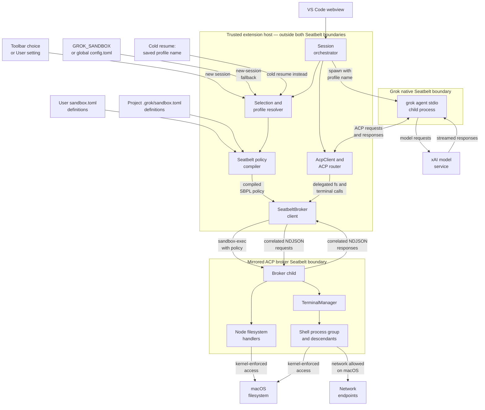

# macOS Sandbox Architecture

The extension uses Apple Seatbelt to contain the filesystem and terminal work
that Grok delegates to its ACP client. This page explains the trust boundary,
how a profile becomes a running policy, what the policy does and does not
protect, and how failures are handled.

For the extension-wide component and message-flow overview, return to the
[general architecture document](architecture.md).

This subsystem is macOS-only. On Linux and Windows the sandbox selector is not
shown and ACP operations continue to use the ordinary extension-host backend.

## Why the broker exists

`grok --sandbox <profile> agent stdio` applies Grok's native process-lifetime
sandbox to the CLI and its descendants. The CLI does not, however, perform most
file edits and shell commands itself: it asks its ACP client—the VS Code
extension—to perform them through mandatory server-to-client methods such as
`fs/write_text_file` and `terminal/create`.

The extension host is outside Grok's native Seatbelt boundary, so applying the
profile only to the CLI would miss those delegated operations. For every live
conversation whose resolved profile is not `off`, the extension therefore adds
a second process-lifetime boundary: a dedicated execution broker launched with
a policy matching Grok's selected profile. Every delegated filesystem
operation, terminal, and command descendant goes through that broker. An `off`
session uses the ordinary host backend.

## Process topology and trust boundary



The extension host is part of the trusted computing base. It reads the selected
profile, compiles the mirrored ACP policy, launches the broker without a shell,
and routes ACP requests. The Grok CLI is outside the broker policy but inside
the separate native Grok policy selected by the same profile name. In parity
with Grok's native macOS sandbox, neither boundary restricts child-process
network access; `restrict_network` is a no-op on macOS.

The broker boundary covers operations delegated through ACP. Grok's own
boundary covers direct I/O by the CLI and its descendants. Neither boundary
sandboxes the VS Code extension host or webview.

## Profile selection

New sessions resolve one profile name in this order:

1. A project-only choice stored in VS Code extension `workspaceState`.
2. The User-scoped `grok.sandboxProfile` setting.
3. The extension's global-state fallback, used by VS Code-derived hosts that
   temporarily reject the registered setting during an upgrade.
4. `GROK_SANDBOX` from the extension host's environment.
5. `[sandbox] profile` in global `$GROK_HOME/config.toml`.
6. Off—no broker and no Seatbelt policy.

Only exact lowercase `off` at a higher-precedence layer stops the search.
Profile names are case-sensitive, so `OFF`, `none`, and `false` may be custom
profile names just as they are in Grok. Repository VS Code settings and project
`.grok/config.toml` never select a profile. A project `.env` may supply ordinary
CLI credentials, but it cannot
override `HOME`, `USERPROFILE`, `GROK_HOME`, `GROK_SANDBOX`, `TMPDIR`, `TMP`, or
`TEMP`.

Cold resumes use a different rule: `summary.json.sandbox_profile` supplies the
profile name. An unreadable summary or a non-string field aborts the resume;
legacy summaries with no field resume with the sandbox off.

Only the **name** is persisted. The extension recompiles that name from the
current profile definitions on every cold resume. Editing or removing a custom
definition can therefore change or prevent a later resume. A live session is
unaffected because Seatbelt policy is fixed when its broker process starts.

## Profile definitions and inheritance

Custom definitions are read from:

1. `$GROK_HOME/sandbox.toml`—normally `~/.grok/sandbox.toml`.
2. `<project>/.grok/sandbox.toml`.

The project file replaces a same-name user definition rather than merging with
it. Built-in names are reserved and cannot be redefined. Selecting a custom
profile therefore means trusting the open project's same-name definition, if
one exists.

Supported fields are:

| Field | Meaning |
|---|---|
| `extends` | One built-in parent: `workspace`, `devbox`, `read-only`, or `strict`. Omitted means `workspace`. |
| `restrict_network` | Override the inherited network verdict. |
| `read_only` | Add readable paths. |
| `read_write` | Add readable and writable paths. |
| `deny` | Add exact paths or supported glob patterns denied for both read and write. |

Each custom profile derives directly from one built-in. Custom-to-custom
inheritance and `extends = "off"` are rejected, matching Grok. The custom path
arrays and deny entries are additive to that base and deduplicated;
`restrict_network` overrides the base value when present. Duplicate or unknown
fields, malformed arrays or booleans, unsupported parents, and unsupported glob
syntax are startup errors.

Example: a review profile with explicit secret-file read protection:

```toml
[profiles.protected-review]
extends = "read-only"
read_write = ["."]
deny = ["**/.env", "**/*.pem"]
```

The `off` profile is not a valid parent. To add denies or extra paths, start
from one of the four sandboxed built-ins.

## Built-in profiles

| Profile | Reads | Writes | Command networking on macOS |
|---|---|---|---|
| `off` | No Seatbelt containment; ordinary host backend | No Seatbelt containment; Plan-mode gates still apply | Allowed |
| `workspace` | Everywhere | Project/CWD, all of `$GROK_HOME` (normally `~/.grok`), and trusted temp roots | Allowed |
| `devbox` | Everywhere | Every existing top-level directory except `/data`, `/proc`, `/sys`, and `/dev` | Allowed |
| `read-only` | Everywhere | All of `$GROK_HOME` and trusted temp roots; no project/CWD writes unless it is under one of those roots | Allowed (`restrict_network` is a no-op) |
| `strict` | Project/CWD, `$GROK_HOME`, trusted temp roots, and essential system/runtime paths | Project/CWD, all of `$GROK_HOME`, and trusted temp roots | Allowed (`restrict_network` is a no-op) |

These roots intentionally match Grok's built-in profiles. In particular,
`workspace`, `read-only`, and `strict` allow the whole Grok home directory so
session persistence and the same CLI workflows continue to work. `devbox` is a
reserved built-in and shadows any custom `[profiles.devbox]` definition.

`workspace`, `devbox`, and `read-only` are integrity-oriented profiles, not
confidentiality boundaries: they permit reads from any path. `strict` narrows
reads to the project and essential runtime roots.

Custom profiles inherit one of these base behaviors and then add their own path
rules. They may request `restrict_network`, but—as in Grok's native macOS
sandbox—that setting does not restrict child-process networking on macOS.

## Session startup

For a non-off profile, startup is ordered deliberately:

1. Build the CLI environment while filtering protected project `.env` keys.
2. Select the profile name or recover it from a cold-session summary.
3. For a custom profile, parse the current user and project definition files.
4. Resolve inheritance, normalize macOS path aliases, compile deny globs, and
   emit one Seatbelt policy.
5. Launch the broker child with `/usr/bin/sandbox-exec -p <policy>` and wait for
   its `ready` message.
6. Create `AcpClient` and bind its filesystem handlers, terminal handler, and
   execution-backend disposal exclusively to the ready broker.
7. Register the ACP handlers, then start the client as
   `grok --sandbox <profile> agent stdio`; Grok applies its native boundary and
   creates or loads the ACP session.

The broker is started and wired before Grok can issue delegated operations.
An explicitly selected custom profile remains fail-closed: definition,
compilation, or broker startup failure aborts the session. For a built-in,
Grok's documented behavior is to warn and continue if sandbox application
fails, so the extension warns and continues through the ordinary host-side ACP
backend while still passing the built-in name to Grok itself.

The broker bootstrap environment also removes `NODE_OPTIONS`, `NODE_PATH`, and
every `DYLD_*` variable before launch, sets `ELECTRON_RUN_AS_NODE=1` for the
extension-host runtime executable, and supplies the trusted temp root. This
prevents inherited loader or Node injection settings from changing how the
sandboxed helper starts.

The same profile name is passed to the CLI for native enforcement, session
compatibility, and persistence. The mirrored broker policy separately contains
the host-side ACP work that Grok's process boundary cannot reach.

## Delegated request lifecycle

The broker protocol is newline-delimited JSON over private pipes. Every request
has a numeric ID and one method:

- `fs/read_text_file`
- `fs/write_text_file`
- `terminal/create`
- `terminal/output`
- `terminal/wait_for_exit`
- `terminal/kill`
- `terminal/release`

The request path is:

1. Grok sends a server-to-client ACP request.
2. `AcpClient` applies client-side gates such as Plan-mode mutation blocking.
3. The host proxy sends an ID-correlated NDJSON request to the broker child.
4. Relative paths and terminal working directories resolve from the project
   root. Absolute paths are normalized and left to Seatbelt enforcement.
5. Filesystem requests use Node's filesystem API. Terminal requests create a
   headless shell through `TerminalManager`.
6. The macOS kernel evaluates every filesystem or network syscall against the
   broker's immutable policy.
7. The result or serialized error returns through the same request ID.

Each terminal owns a rolling output buffer and, on POSIX, a dedicated process
group. Descendants inherit the broker's Seatbelt policy automatically.

## Filesystem, device, and network rules

The compiler starts from `(allow default)` and adds filesystem deny rules. This
leaves ordinary process and network behavior intact while placing explicit
containment around file operations.

### Trusted temporary storage

Grok's macOS set—`/tmp`, `/var/tmp`, `/private/tmp`, `/private/var/tmp`,
`/private/var/folders`, and the exact host `TMPDIR`—is admitted where the base
profile allows temporary writes. Compatibility aliases are normalized to their
`/private/...` paths in the generated Seatbelt policy. The broker initializes
`TMPDIR`, `TMP`, and `TEMP` to that same compiled root. Both project `.env`
values and per-command ACP
environment overrides are filtered at their ingress points. A shell command or
runtime may still mutate its own environment, but Seatbelt continues to reject
access outside the paths admitted by the compiled policy.

### Shell-compatible devices

The built-in write-contained policies admit only these write exceptions unless
a custom profile explicitly adds another device path through `read_write`:

- `/dev/null`
- `/dev/zero`
- `/dev/random`
- `/dev/urandom`
- `/dev/ptmx`

These are exact literal grants. `/dev/fd/*`, `/dev/tty`, persistent devices,
and the rest of `/dev` are not made writable. Under `strict`, `/dev` remains
readable as one of Grok's system roots.

### Path expansion and macOS aliases

Relative profile paths resolve from the project root, while `~` and `~/...`
resolve from the trusted home directory. Absolute paths remain absolute.
Because macOS exposes compatibility aliases, `/tmp`, `/var`, and `/etc` paths
are canonicalized to their `/private/...` equivalents before policy generation.

### Writable roots and explicit denies

The built-in writable roots are not silently narrowed by extension-specific
credential or control-plane guards. `workspace`, `read-only`, and `strict`
admit all of `$GROK_HOME`, exactly as Grok does, while `workspace` and `strict`
also admit the project. `devbox` admits every non-virtual top-level tree except
`/data`, `/proc`, `/sys`, and `/dev`; the safe device literals above remain the
only write exceptions beneath `/dev`.

Use a custom profile's `deny` list when a file or directory must remain
unreadable and unwritable. Denies are applied after inherited `read_only` and
`read_write` grants, so a broader grant cannot reopen a denied path.

### Network isolation

`restrict_network` is intentionally a no-op on macOS, matching Grok's native
Seatbelt behavior. The broker child, terminal shells, scripts, and descendants
retain network access even when the selected built-in or custom profile resolves
that field to `true`. Grok enforces child-network blocking only on Linux, which
is outside this macOS-only broker subsystem.

## Failure and teardown behavior

Startup follows Grok's built-in/custom distinction, while live failures remain
fail-closed:

- Invalid custom-profile data fails before any broker or Grok session starts.
- A built-in broker-application failure emits a visible warning and continues;
  unrelated malformed custom definitions cannot break a built-in.
- The broker must emit `ready` within five seconds.
- Invalid protocol JSON, a closed protocol stream, process errors, and
  unexpected exits mark the broker dead and reject all pending operations.
- A fatal broker error disposes the matching Grok client instead of rerouting
  work through the unsandboxed extension host.
- Normal client disposal waits for its execution backend to be disposed.

On shutdown, the host sends a broker `dispose` sentinel. The child releases all
terminals, sends `SIGTERM` to each POSIX process group, and escalates to
`SIGKILL` after 500 ms. The broker remains alive long enough for that escalation
and the host has an additional termination fallback if cooperative shutdown
does not complete.

Because each sandboxed live conversation owns its own broker and process tree,
stopping, restarting, reaping, or crashing one session does not relax another
session's policy or terminate its commands.

## Explicit non-goals and limitations

- No equivalent Seatbelt broker is provided on Linux or Windows.
- The extension host is outside both boundaries; it remains trusted.
- The Grok CLI is inside its native profile boundary, while delegated
  filesystem and terminal operations are inside the mirrored broker boundary.
- `workspace` and `read-only` do not provide read confidentiality.
- `restrict_network` does not block networking on macOS.
- Project custom definitions are trusted configuration input and may widen a
  selected custom profile; built-in profile names cannot be replaced.
- A profile update is not retroactive. Restart the session to compile a new
  process-lifetime policy.
- Cold resume freezes the profile name, not the policy body.
- PTY-based tools such as `expect`, `script`, and `node-pty` are not supported
  by the default write-contained policies.

## Source map

| Component | Source |
|---|---|
| Selection precedence and protected workspace environment | [`src/grok-config.ts`](../src/grok-config.ts) |
| Session orchestration, restore, compilation, and exclusive broker wiring | [`src/sidebar.ts`](../src/sidebar.ts) |
| TOML parsing, inheritance, path/glob handling, and SBPL generation | [`src/seatbelt-policy.ts`](../src/seatbelt-policy.ts) |
| Host-side broker lifecycle and correlated protocol | [`src/seatbelt-broker.ts`](../src/seatbelt-broker.ts) |
| Sandboxed filesystem and terminal executor | [`src/seatbelt-broker-child.ts`](../src/seatbelt-broker-child.ts) |
| Command buffering and process-group teardown | [`src/terminal-manager.ts`](../src/terminal-manager.ts) |
| ACP request routing and execution-backend disposal | [`src/acp.ts`](../src/acp.ts) |
| Policy and broker regression tests | [`test/seatbelt-policy.test.ts`](../test/seatbelt-policy.test.ts), [`test/seatbelt-broker.test.ts`](../test/seatbelt-broker.test.ts) |

The test-layer inventory lives in [`TESTS.md`](../TESTS.md). Native macOS probes
also cover redirection, process substitution, temp files, denied outside writes,
and the deliberate absence of TTY/PTY device access.
